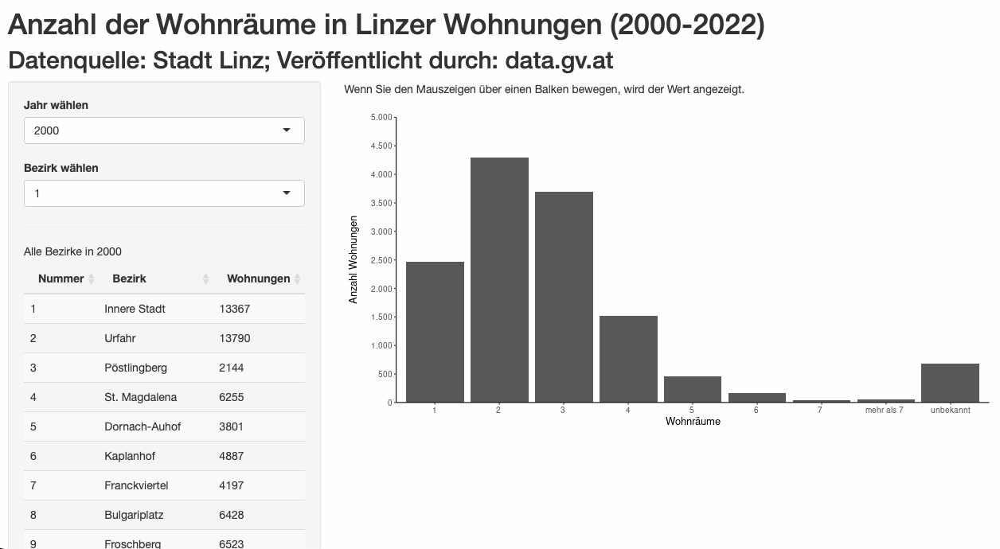
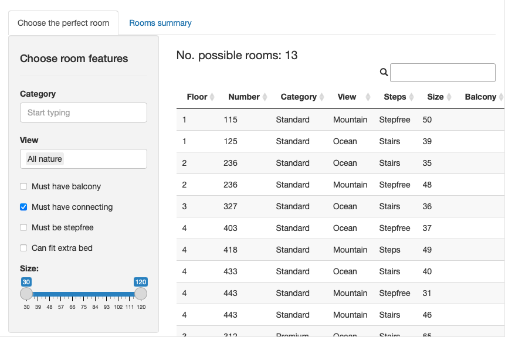
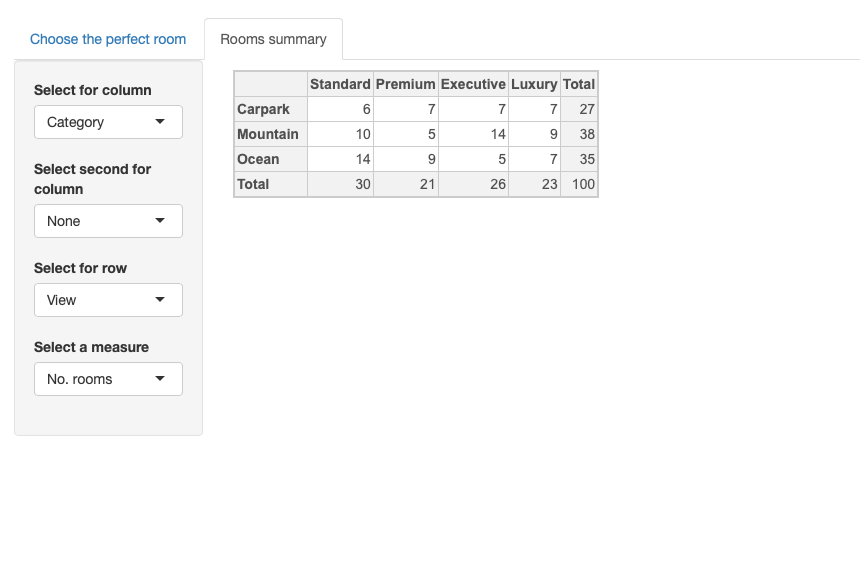

## Linzer Wohnungen
Flats in Linz from 2000-2022 according to number of rooms. Data from Stadt Linz and is downloaded at the start of the code. Area plot shows number of rooms and line plot shows percentage change in number of rooms compared to previous year. [Figure version here. ](https://github.com/rkan0/figures_austria/tree/main/linz_wohnung)

    
    

## Hotel room selector

Shiny app to view a list of rooms in a hotel filtered by selected room features. Second tab builds a contingency/pivot table based on room features. 

  
  

## Price lookup 

This tool returns the necessary information for a hotel employee to update a reservation  when a hotel guest pays a fee for a higher category room (i.e. is 'upsold'). Users look up the original booking by its room type, room number, or rate code, and then select new room by a room number or type. The results display the price difference, the new room type and rate code, and indicates if the charge is to be booked separately to the nightly room rate. Users can also use this during the selling process to look up the price difference between rooms/room types without providing a specific rate code. 

  

